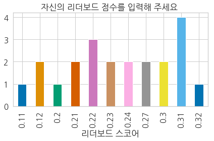
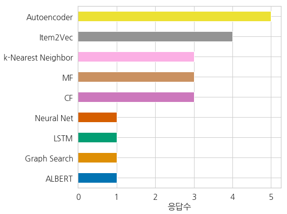
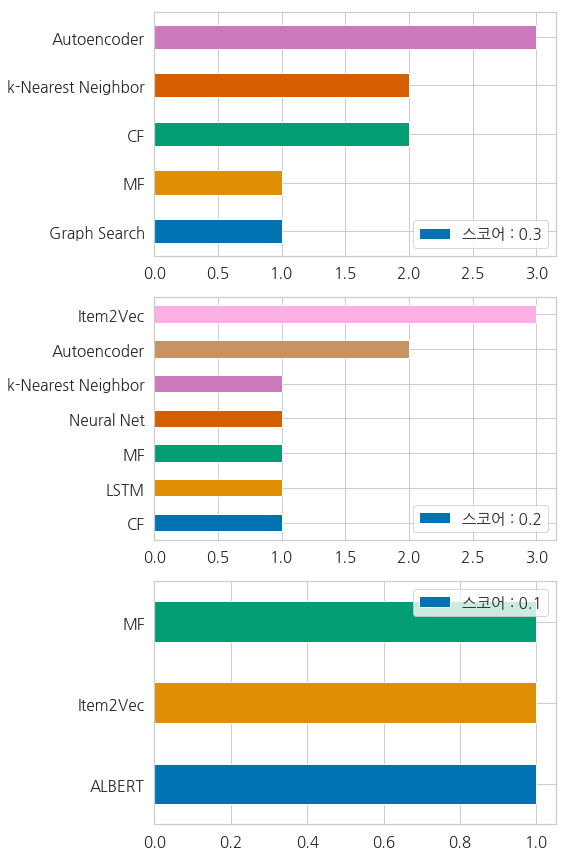

# [Kakao Arena 3rd] Melon Playlist Continuation Submission Code

<h2 id="context"> :pushpin: 대회 개요 </h2>
https://arena.kakao.com/c/7

주어진 **플레이리스트와 동반된 노래정보(Metadata, Mel-Spectogram)을 활용**하여, 
**"플레이리스트를 구성하는 #태그와 #노래를 예측하라"**

## :clipboard: 목차
<ol>
<li><a href="#context">대회개요</a></li>
<li><a href="#schedule">진행일정</a></li>
<li><a href="#reference">참고자료</a></li>
<li><a href="#repo-composit">Repo 구성</a></li>
<li><a href="#execution">실행</a></li>
<li><a href="#review">대회후기</a></li>
</ol>

<h2 id="schedule"> :calendar: 진행일정</h2>
2020년 4월 27일(월) ~ 2020년 7월 26(일) [90일]

※ 실제 참가 시작일: 2020년 5월 2일(토)

* 1주차(5/2~5/10): 추천시스템에 대한 이해
* 2주차(5/11~5/17): 추천시스템 구현 알고리즘에 대한 이해
* 3주차(5/18~5/24): Neural-Net 기반의 MF 알고리즘 구현 & EDA 진행 #1
* 4주차(5/25~5/31): Neural-Net 기반의 MF 알고리즘 구현 & EDA 진행 #2
* 5주차(6/1~6/7): Neural-Net 기반의 MF 알고리즘 구현 & EDA 진행 #3
* 6주차(6/8~6/14): ALS를 통한 MF 알고리즘 구현 & ICBF 알고리즘 구현 
* 7주차(6/15~6/21): ICBF K-Nearest Neighbors 알고리즘 구현
* 8주차(6/22~6/28): Recommendation System Top 20 이해
* 9주차(6/29~7/5): ICBF 알고리즘 구현 #2
* 10주차(7/6~7/12): ICBF 알고리즘 구현 #3, CBF 알고리즘 구현
* 11주차(7/13~7/19): Hybrid(CBF+ICBF) 알고리즘 구현 #1
* 12주차(7/20~7/26): Hybrid(CBF+ICBF) 알고리즘 구현 #2, 제출 github repository 구현

<h2 id="reference"> :books: 참고자료 </h2>

* 갈아먹는 추천 알고리즘 [1]~[6]  
   https://yeomko.tistory.com/3?category=805638
* 파이썬 머신러닝 완벽가이드 [9장. 추천시스템]  
   http://www.yes24.com/Product/Goods/69752484
* Recommendation System With Implicit Feedback  
   http://sanghyukchun.github.io/95/
* MF Using Deep Neural Networks [NeuMF]  
   1. https://dnddnjs.github.io/recomm/2019/08/15/neural_collaborative_filtering/
   2. https://itkmj.blogspot.com/2019/09/neural-collaborative-filtering.html
   3. https://medium.com/@victorkohler/collaborative-filtering-using-deep-neural-networks-in-tensorflow-96e5d41a39a1
   4. https://towardsdatascience.com/neural-collaborative-filtering-96cef1009401
* Recommendation Top 20  
    https://www.facebook.com/groups/2611614312273351/permalink/2639027142865401/
* Understading the Mel-Spectogram   
    https://medium.com/analytics-vidhya/understanding-the-mel-spectrogram-fca2afa2ce53
* Introduction to TWO approaches of Content-based Recommendation System  
    1. https://towardsdatascience.com/introduction-to-two-approaches-of-content-based-recommendation-system-fc797460c18c
    2. https://github.com/youonf/recommendation_system/tree/master/content_based_filtering

<h2 id="repo-composit"> :open_file_folder: Repo 구성 </h2>

* ./idea, \__pycache\__, venv: pycharm 프로젝트 구성 파일 디렉터리
* /data: 학습 및 예측을 위한 데이터 적재 디렉터리 (w/o Mel-Spectogram)  
   **- .json 파일들(train,test,val,song_meta,genre_gn_all)의 용량 문제로 인해 학습 및 예측 수행 전 데이터 적재 필요!**
* /result: 학습을 통해 예측을 수행한 결과 파일(.json)이 저장되는 디렉터리  
   **- 저장 포맷: '[valid | test]_[hybrid | icbf]_rcomm_result.json'**
* /web_driver: 한글 불용어 crawling을 위한 chrome webriver(chromedriver.exe) 실행파일 저장 디렉터리  
   **- chrome webdriver version = 84 (실행 환경에 따른 driver 설치 필요)**  
   ※ chrome webdriver 버전 확인 - https://codechacha.com/ko/selenium-chromedriver-version-error/
* inference.py: 학습 및 예측을 실행을 위한 python 파일  
   **- 사용법은 <a href="#how-to-execute">실행-실행법</a> 참고**
* train.py: 학습 실행을 위한 python 파일  
   **- 사용법은 <a href="#how-to-execute">실행-실행법</a> 참고**
* data_loader.py: 학습 데이터 로드를 위한 python 파일 (inference.py or train.py에서 실행 시 내부적으로 사용)
* models.py: 학습에 사용될 model들을 저장하는 python 파일  
   **- 예측에 사용되는 두 개의 모델이 각각 Class로 구분되어 저장되어있음.**  
   - 클래스 및 예측 모델 구성 (클래스명 - 모델명)
       + ICBF_OCC - 아이템 기반 협업 필터링 (icbf)
       - HYBRID_CBF_ICBF - 하이브리드 필터링 (Hybrid Filtering-CBF+ICBF+REMINDER)

<h2 id="execution"> :exclamation: 실행 </h2>

<h3><b>※주의</b></h3>
해당 프로젝트는 Windows, Linux 환경 모두에서 실행될 수 있도록 만들어졌으나, 시간 상의 이유로 Windows만 구동 테스트를 완료하였습니다.
<b>따라서, Windows 환경에서 실행해야 합니다.</b>

<h3>구현 알고리즘</h3>

1. 아이템 기반 협업 필터링(Item-based Collaborative Filtering - icbf)
2. **[제출] Hybrid 필터링 방식 (Hybrid Filtering [ICBF+CBF+REMINDER] - hybrid)**

<h3>사용 패키지</h3>

* Python3 내장 패키지 
argparse, warnings, json, io, platform, os, collections 
* Python3 외장 패키지
    - 데이터 조작 - pandas, numpy, sklearn, scipy  
    - 진행상황 모니터링 - tqdm  
    - plylst_title 불용어 추출 - nltk, selenium  

<h3>실행 전 준비사항</h3>
<ol>
<li>실행을 위한 <b>사용 패키지 설치</b></li>
<li>/data 디렉터리에 사용되는 <b>input data 적재(train.json, test.json, val.json, song_meta.json, genre_gn_all.json)</b></li>
<li>/webdriver 디렉터리에 한글 불용어 Crwaling을 위한 <b>실행환경의 버전에 맞는 chromedriver 설치</b>  ※ chrome webdriver 버전 확인 - https://codechacha.com/ko/selenium-chromedriver-version-error/</li>
</ol>

<h3 id="how-to-execute">실행법</h3>

* inference.py  
    1. 설명  
    주어진 데이터를 활용하여 예측을 수행하는 python 파일
    2. 실행  
    python inference.py --model_type hybrid --is_valid True
    3. 옵션
        * --model_type - [icbf | hybrid]  
        : 예측을 수행할 모델의 타입을 결정하는 파라미터.  
            * icbf: 아이템 기반 협업 필터링 방식을 통한 Recommendation 진행
            * hybrid: 아이템 기반 협업 필터링 + 컨텐츠기반 필터링 + 예외처리 방식을 통한 Recommendation 진행
        * --is_valid - boolean [True | False]  
        : 예측을 수행할 데이터 타입을 결정하는 파라미터  
            * True: /data/val.json을 대상으로 하여 Recommendation 진행
            * False: /data/test.json을 대상으로 하여 Recommendation 진행
    4. 수행시간
        * --model_type = icbf +  --is_valid = True  
            : 약 40분 ~ 1시간
        * --model_type = icbf +  --is_valid = False  
            : 약 30분 ~ 40분
        * --model_type = hybrid +  --is_valid = True  
            : 약 40분 ~ 1시간
        * --model_type = hybrid +  --is_valid = False  
            : 약 30분 ~ 40분
    
* train.py  
  **※ 주의**  
    **해당 프로젝트에서는 pytorch, tensorflow, keras등의 학습 모델 생성을 통한 예측을 진행하지 않기 때문에, inference.py 와 동일함.**
  
    1. 설명  
  
      주어진 데이터를 활용하여 모델을 학습하는 python 파일  
  
    2. 실행  
  
      python train.py --model_type hybrid --is_valid True
    3. 옵션
        * --model_type - [icbf | hybrid]  
        : 예측을 수행할 모델의 타입을 결정하는 파라미터.  
            * icbf: 아이템 기반 협업 필터링 방식을 통한 Recommendation 진행
            * hybrid: 아이템 기반 협업 필터링 + 컨텐츠기반 필터링 + 예외처리 방식을 통한 Recommendation 진행
        * --is_valid - boolean [True | False]  
        : 예측을 수행할 데이터 타입을 결정하는 파라미터  
            * True: /data/val.json을 대상으로 하여 Recommendation 진행
            * False: /data/test.json을 대상으로 하여 Recommendation 진행
    4. 수행시간
        * --model_type = icbf +  --is_valid = True  
            : 약 40분 ~ 1시간
        * --model_type = icbf +  --is_valid = False  
            : 약 30분 ~ 40분
        * --model_type = hybrid +  --is_valid = True  
            : 약 40분 ~ 1시간
        * --model_type = hybrid +  --is_valid = False  
            : 약 30분 ~ 40분
            
<h3>결과 파일</h3>

**/result 아래, '[valid | test]_[hybrid | icbf]_rcomm_result.json' 형태로 결과값이 반환됨.**  
e.g) test_hybrid_rcomm_result.json

<h3>예측 결과</h3>

* icbf  
  valid LB - song - 0.159576 / tag - 0.340179 = 0.18666645 [61st in leaderboard]

* **[제출] hybrid**  
  valid LB - song - 0.160008 / tag - 0.411810 = 0.197778 [55th in leaderboard]
            
<h2 id="review"> :checkered_flag: 대회후기</h2>

대회 종료후 약 4개월만에 우승자 코드를 리뷰할 수 있는 시간이 있어서 대회 후기를 작성하려 한다.

우선, 대회를 진행함에 있어서 신경망을 설계하고 훈련하는데 있어서 모르는것이 많았다. 그래서 신경망을 사용하지 않는 전통적인 방식인 CF(Collaborative Filtering)와 CBF(Contents-Based Filtering)으로 Recommendation을 수행했다.

CF와 CBF를 Recommendation에 있어서 동시에 사용한 이유는 CF만을 사용했을때에 발생하는 문제점 때문이다. 일반적으로 CF 방식을 활용한 Recommendation은 성능이 나쁘지 않다. 왜냐하면 특정 사용자의 선호를 바탕으로 유사도를 분석하여 유사한 아이템을 추천하기 때문이다.

그러나 '특정 사용자의 선호'가 없는 경우는 어떤 정보를 기반으로 추천할 것인가? 이렇게 사용자에 대한 사전 지식이 없는 경우 추천의 성능이 떨어지는 현상을 'Cold Start Problem'라고 한다.

* About Cold Start Problem

  + https://yuspify.com/blog/cold-start-problem-recommender-systems/

  + https://kojinoshiba.com/recsys-cold-start/
  + https://towardsdatascience.com/solving-cold-user-problem-for-recommendation-system-using-multi-armed-bandit-d36e42fe8d44

이와 같은 문제를 해결하기 위해서는 여러가지 방법(가장 대중적인 item을 추천, Contents-Based, MAB, DropoutNet)이 있다. 그러나 이 중 상대적으로 쉽게 구현할 수 있는 다른 Metadata를 활용한 Contents-Based 방식을 활용하여 문제에 직면하여 예측할 수 없는 사용자에 대해 추천을 진행했다.

그리고, CF 방식을 활용함에 있어서 위의 문제 말고도 'Filter Bubble 현상'이 발생할 수 있다고 한다. Filter Bubble은 쉽게 말해 특정 User에 대해 Recommendation을 진행할 수록 특정 유사한 취향에 대해서만 추천이 이루어지는 것을 말한다. 

*  About Filter bubble Problem
  + https://choosetoencrypt.com/tech/collaborative-filtering/

이 대회를 통해 느낀점은 복잡한 모델이 좋은 score로 이어지지 않는다는 것이다. 오히려 기본적으로 사용되는 MF와 CF 등이 좋은 성능을 보였다. 그리고 복잡한 모델은 워낙 데이터의 양이 커서 Memory Leakage 문제에 부딪혀서 활용할 수 없었다. 따라서, 보수적으로 문제 해결에 있어서 가능한 간단한 모델을 사용해보고, 성능이 좋은 방식에서 발전시켜 문제를 해결해야 함을 느꼈다.

* 대회 참가자 대상 research 자료

  https://arena.kakao.com/forum/topics/295

	
	
<b>참가자 점수 분포</b>

	
	
<b>참가자 사용 모델</b>

	
	
<b>성능 수준별 사용 모델</b>

대회의 5등 코드를 먼저 살펴보았다. 여기서는 Autoencoder와 W2V모델로 embedding한 vector를 CF와 유사하게 유사도를 계산하여 상위 k개의 유사한 playlist에서 곡과 태그를 반환했다. 이를 따지고 보면 간단하게 도입할 수 있는 모델에서 AE나 w2v모델을 활용하여 develop하였다고 볼 수 있다.

다른 우승자 코드를 더 살펴보기 전에 참가자들 대상으로 실시한 조사에서 언급된 추천 논문들을 읽어보려고 한다.  

**\* Auto Encoder**

\* MMCF: Multimodal Collaborative Filtering for Automatic Playlist Continuation, https://dl.acm.org/doi/10.1145/3267471.3267482

 \* Using Adversarial Autoencoders for Multi-Modal Automatic Playlist Continuation, https://zenodo.org/record/1455214/files/Vagliano-et-al-Using-Adversarial-Autoencoders-for-Multi-Modal-Automatic-Playlist-Continuation.pdf?download=1

 \* A Hybrid Variational Autoencoder for Collaborative Filtering, https://www.kdd.org/kdd2018/files/deep-learning-day/DLDay18_paper_45.pdf

 \* Training Deep AutoEncoders for Collaborative Filtering, https://arxiv.org/abs/1708.01715

**\* k-NN**

 \* Efficient K-NN for Playlist Continuation, https://eprints.sztaki.hu/9560/1/Kelen_1_30347064_ny.pdf

**\* Matrix Factorization** 

 \* Neural Collaborative Filtering vs Matrix Factorization Revisited, https://arxiv.org/pdf/2005.09683.pdf

 \* https://yeomko.tistory.com/5

**\* Deep Learning**

 \* Deep Neural Networks for YouTube Recommendations, https://static.googleusercontent.com/media/research.google.com/en//pubs/archive/45530.pdf

 \* Deep Learning in Natural Language Processing.pdf, http://ling.snu.ac.kr/class/AI_Agent/deep_learning_for_nlp.pdf

 \* Taming Pretrained Transformers for Extreme Multi-label Text Classification, https://arxiv.org/pdf/1905.02331v4.pdf

 \* Convolutional recurrent neural networks for music classification, https://arxiv.org/pdf/1609.04243.pdf

**\* ETC**

 \* Spotify’s Recommendation Engine, https://ischools.org/resources/Documents/Discipline%20of%20organizing/Case%20Studies/Spotify-Ngo2019.pdf

 

 

 